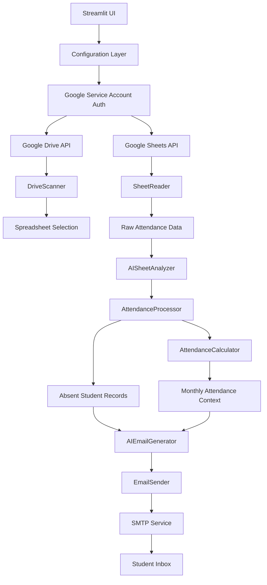

# 🤖 Attendance Email AI Agent

An AI-powered attendance automation system that reads Google Sheets attendance records, detects absences, analyzes flexible sheet layouts, generates personalized email notifications with an LLM, and provides a Streamlit dashboard for review and dispatch.

This project was built to solve a real operational problem in academic environments: faculty and administrators often spend unnecessary time checking attendance spreadsheets, identifying absent students, calculating attendance context, and drafting repetitive emails manually. The agent reduces that workflow to a single streamlined interface backed by Google APIs, AI-assisted sheet understanding, and automated email generation.

## 🌟 Why This Project Matters

Manual attendance follow-up is repetitive, error-prone, and difficult to scale across multiple classes and spreadsheet formats. This system improves that process by:

- automating spreadsheet discovery and parsing from Google Drive
- handling inconsistent attendance sheet structures with AI-assisted analysis
- consolidating multiple missed lectures into one notification per student
- generating professional communication instead of static template spam
- enabling deployment on Streamlit Cloud without committing secrets to GitHub

For employers, this project demonstrates applied AI engineering, backend integration, secure deployment thinking, workflow automation, and product-oriented UI delivery in one end-to-end system.

## 🎯 Problem Statement

Educational institutions commonly track attendance in spreadsheets, but the follow-up process usually remains manual:

- staff must open Google Drive folders and find the right file
- spreadsheet formats vary by class or faculty member
- absent students must be identified by hand
- attendance context must be summarized manually
- notification emails must be written and sent repeatedly

This project solves that by combining cloud APIs, structured data processing, and LLM-based content generation into a single automated pipeline.

## ✨ Key Features

- Google Drive folder scanning for attendance spreadsheets
- Google Sheets reading through service-account authentication
- AI-based sheet structure analysis for semi-structured attendance formats
- Student-level absence extraction across multiple tabs
- Monthly attendance percentage calculation
- Personalized HTML email generation with Groq LLM
- Single-email consolidation for students absent in multiple lectures
- Streamlit dashboard for spreadsheet selection, preview, analysis, and dispatch
- Secure deployment path using Streamlit secrets or runtime credential upload
- Modular Python architecture suitable for extension and maintenance

## 🏗️ Architecture



### 🧩 Component Architecture Diagram

```text
┌────────────────────────────── Streamlit Frontend ──────────────────────────────┐
│                                                                                 │
│  - Drive URL input                                                              │
│  - Runtime credential input                                                     │
│  - Attendance summary                                                           │
│  - AI email preview                                                             │
│  - Bulk dispatch controls                                                       │
│                                                                                 │
└───────────────────────────────────┬─────────────────────────────────────────────┘
                                    │
                                    ▼
┌──────────────────────────── Configuration Layer ────────────────────────────────┐
│  config.py + secret_loader.py                                                   │
│  - Streamlit secrets                                                            │
│  - Environment variables                                                        │
│  - Runtime JSON upload / paste                                                  │
└───────────────────────────────────┬─────────────────────────────────────────────┘
                                    │
                 ┌──────────────────┴──────────────────┐
                 ▼                                     ▼
┌───────────────────────────┐             ┌───────────────────────────┐
│ Google Drive Integration  │             │ Google Sheets Integration │
│ drive_scanner.py          │             │ sheet_reader.py           │
│ - folder scanning         │             │ - tab discovery           │
│ - spreadsheet selection   │             │ - row extraction          │
└───────────────┬───────────┘             └───────────────┬───────────┘
                │                                         │
                └──────────────────┬──────────────────────┘
                                   ▼
┌──────────────────────────── Attendance Engine ──────────────────────────────────┐
│  ai_sheet_analyzer.py                                                           │
│  attendance_processor.py                                                        │
│  attendance_calculator.py                                                       │
│                                                                                 │
│  - infer sheet structure                                                        │
│  - identify absent students                                                     │
│  - map missed lectures                                                          │
│  - calculate monthly attendance                                                 │
└───────────────────────────────────┬─────────────────────────────────────────────┘
                                    │
                                    ▼
┌──────────────────────────── AI Communication Layer ─────────────────────────────┐
│  ai_email_generator.py                                                          │
│  - Groq LLM                                                                     │
│  - personalized HTML email generation                                           │
└───────────────────────────────────┬─────────────────────────────────────────────┘
                                    │
                                    ▼
┌──────────────────────────── Notification Layer ─────────────────────────────────┐
│  email_sender.py                                                                │
│  - SMTP authentication                                                          │
│  - message dispatch                                                             │
│  - delivery logging                                                             │
└───────────────────────────────────┬─────────────────────────────────────────────┘
                                    │
                                    ▼
                          ┌──────────────────────────┐
                          │ Student / Parent Inbox   │
                          └──────────────────────────┘
```

## 🔄 Workflow

1. The user opens the Streamlit dashboard.
2. The app loads configuration from Streamlit secrets, local environment variables, or runtime input.
3. A Google Drive folder URL or direct spreadsheet URL is provided.
4. The system authenticates with Google using a service account.
5. The Drive scanner lists spreadsheets from the selected folder or reads the provided sheet directly.
6. The Sheet reader loads tab names and row data from Google Sheets.
7. The AI sheet analyzer interprets the sheet layout and maps important columns.
8. The attendance processor extracts student records and identifies absences.
9. The attendance calculator derives attendance context for the current month.
10. The AI email generator creates personalized HTML email content with Groq.
11. The email sender dispatches notifications through SMTP.
12. The dashboard shows summaries, previews, logs, and dispatch status.

## 🧠 AI Technology Used

This project uses AI in two practical ways rather than using an LLM as a gimmick:

- `Sheet structure understanding`
  The `AISheetAnalyzer` helps interpret attendance sheets when layouts are inconsistent across tabs or classes. Instead of hardcoding one rigid format, the system can infer where roll number, student name, email, and attendance columns are located.

- `Personalized communication generation`
  The `AIEmailGenerator` uses the Groq API with the `llama-3.3-70b-versatile` model to generate clear, professional attendance emails tailored to each student’s absence details and attendance context.

This is a strong example of applied AI for workflow intelligence and communication automation.

## 🛠️ Tech Stack

- Python
- Streamlit
- Google Drive API
- Google Sheets API
- Google Service Account authentication
- Groq API
- SMTP
- Pandas
- `google-api-python-client`
- `python-dotenv`

## 📁 Project Structure

```text
Attendance-AI-Agent/
├── agent/
│   ├── ai_email_generator.py
│   ├── ai_sheet_analyzer.py
│   ├── attendance_calculator.py
│   ├── attendance_processor.py
│   ├── drive_scanner.py
│   ├── email_sender.py
│   ├── logger.py
│   ├── prompts.py
│   ├── security.py
│   ├── sheet_reader.py
│   ├── utils.py
│   └── validator.py
├── assets/
│   └── style.css
├── config/
│   ├── config.py
│   ├── constants.py
│   └── secret_loader.py
├── .streamlit/
│   └── secrets.toml.example
├── main.py
├── run.py
├── streamlit_app.py
├── ui_server.py
├── project_analyzer.py
├── requirements.txt
├── .gitignore
└── README.md
```

## 🚀 Deployment

The app is designed for Streamlit Cloud deployment without uploading credential files to GitHub.

### ☁️ Deploy on Streamlit Cloud

1. Push the repository to GitHub.
2. Do not upload `.env`, `credentials/`, or `.streamlit/secrets.toml`.
3. Create a new Streamlit Cloud app.
4. Set the entry point to `streamlit_app.py`.
5. Add Google service-account credentials in Streamlit secrets, or upload/paste them at runtime in the sidebar.
6. Share the target Google Drive folder or spreadsheets with the service-account email.

### 💻 Run Locally

```bash
pip install -r requirements.txt
streamlit run streamlit_app.py
```

## 🔐 Security Design

This project was intentionally adapted for safer deployment:

- secrets are not required to live inside the repository
- Google service-account JSON can be provided through Streamlit secrets
- local file-based credentials are optional, not mandatory
- SMTP and Groq credentials can be entered at runtime
- `.gitignore` excludes sensitive files such as `.env`, `credentials/`, and `.streamlit/secrets.toml`

If any real keys or passwords were previously stored in `.env` or committed anywhere, they should be rotated.

## 💼 What This Project Demonstrates

This project is a strong portfolio piece because it shows:

- end-to-end product thinking, from backend automation to usable frontend delivery
- integration of multiple third-party services in one workflow
- real-world AI usage beyond chat interfaces
- secure deployment considerations for cloud-hosted apps
- modular Python code organization
- applied automation for education operations

## 📸 Screenshots

### Dashboard Overview


---

### Attendance Analysis View


---

### AI Email Preview


---

### Email Dispatch Logs


---

### 📈 API Monitoring Dashboard

The Attendance Email AI Agent continuously monitors the health and performance of the Google Cloud services used during execution.


---

## 📈 Future Improvements

- role-based authentication for faculty and admins
- scheduled execution with cron or cloud jobs
- WhatsApp or SMS notification channels
- analytics dashboard for attendance trends
- historical reporting by class, subject, or student
- confidence scoring for AI-based sheet mapping
- audit trail for sent communications
- retry queue and failure recovery for email delivery
- exportable attendance insights and PDF reports


## 📄 License

This project is licensed under the MIT License.
